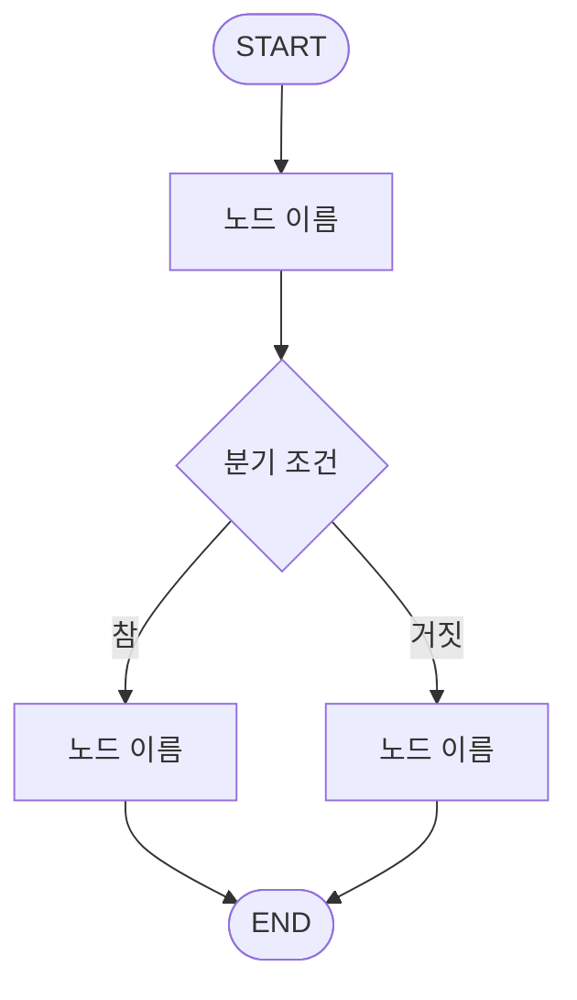
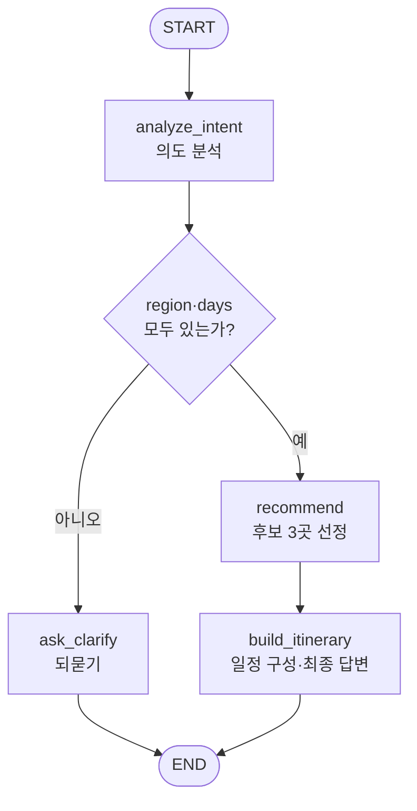

# LangGraph 챌린지 플랫폼 Implementation Plan

> **For agentic workers:** REQUIRED SUB-SKILL: Use superpowers:subagent-driven-development (recommended) or superpowers:executing-plans to implement this plan task-by-task. Steps use checkbox (`- [ ]`) syntax for tracking.

**Goal:** 8개 조(0~7조)가 각자 폴더에 LangGraph MultiAgent를 개발해 붙이면, 하나의 FastAPI 앱이 자동으로 탭을 만들어 채팅으로 실행해주는 챌린지 플랫폼을 만든다.

**Architecture:** FastAPI 단일 프로세스가 `teams/team{N}/workflow.py`를 기동 시 스캔·동적 import 해 탭 목록을 구성하고, `POST /api/chat/{team_id}`로 해당 조의 컴파일된 LangGraph를 실행한다. 조원은 자기 폴더만 수정하므로 조별 브랜치 merge 시 충돌이 발생하지 않는다. 빌드된 React 정적 파일은 같은 프로세스가 서빙해 포트 하나(8021)로 끝난다.

**Tech Stack:** Python 3.11 / FastAPI / uvicorn / LangGraph / LangChain / langchain-openai / pytest / React 18 / Vite

**Spec:** `docs/superpowers/specs/2026-09-04-langgraph-challenge-platform-design.md`

## Global Constraints

- 소스코드와 팀원용 문서 어디에도 "사내", "보안망", "내부망" 등 특정 조직 환경을 암시하는 워딩을 넣지 않는다. `LEAD_GUIDE.md`만 예외다.
- 조원이 수정하는 범위는 `teams/teamN/` 폴더 내부로 한정한다. 그 밖의 파일은 조원 수정 금지임을 코드 주석과 문서에 명시한다.
- LLM Endpoint/API Key는 저장소에 실제 값을 넣지 않는다. `.env.example`에 빈 값으로만 제공한다.
- 대상은 초심자다. 조원이 채울 파일에는 "여기에 작성하시면 됩니다" 류의 안내 주석을 충분히 넣는다.
- 의존성은 루트 `requirements.txt` 하나로 통일한다. 파일 맨 아래 `# --- 조별 추가 ---` 구역에만 append 하도록 문서화한다.
- repo 분할 스크립트(`split-repos.ps1` 류)는 만들지 않는다.
- 서버 포트 기본값은 8021이다.
- 조별 폴더명은 `team0` ~ `team7`, 표시명은 "N조"다.
- 파이썬 코드 주석/문서는 한국어, 식별자는 영어로 작성한다.

---

### Task 1: 프로젝트 뼈대와 공용 계약 타입

**Files:**
- Create: `requirements.txt`, `.env.example`, `pytest.ini`
- Create: `app/__init__.py`, `app/contract.py`, `app/schemas.py`, `app/llm.py`
- Test: `tests/__init__.py`, `tests/test_contract.py`, `tests/test_llm.py`

**Interfaces:**
- Consumes: 없음 (첫 태스크)
- Produces:
  - `app.contract.BaseGraphState` — TypedDict(`user_input: str`, `messages: list[dict]`, `answer: str`)
  - `app.contract.make_initial_state(user_input: str, messages: list[dict] | None = None) -> dict`
  - `app.schemas.ChatMessage` — Pydantic(`role: str`, `content: str`)
  - `app.schemas.ChatRequest` — Pydantic(`message: str`, `history: list[ChatMessage] = []`)
  - `app.schemas.TraceEntry` — Pydantic(`node: str`, `ms: int`)
  - `app.schemas.ChatResponse` — Pydantic(`answer: str = ""`, `trace: list[TraceEntry] = []`, `error: str | None = None`)
  - `app.schemas.TeamSummary` — Pydantic(`id, number, name, description, examples, status, error`)
  - `app.schemas.TeamListResponse` — Pydantic(`teams: list[TeamSummary]`)
  - `app.llm.get_llm(temperature: float = 0.3, model: str | None = None) -> ChatOpenAI`
  - `app.llm.LLMConfigError` — 환경변수 미설정 시 발생하는 예외

- [ ] **Step 1: requirements.txt 작성**

```
# ── 공용 (수정하지 마세요) ─────────────────────────────
fastapi==0.115.6
uvicorn[standard]==0.34.0
python-dotenv==1.0.1
pydantic==2.10.4
langgraph==0.2.60
langchain==0.3.14
langchain-core==0.3.29
langchain-openai==0.2.14
langchain-community==0.3.14
httpx==0.28.1
pytest==8.3.4
pytest-asyncio==0.25.2

# --- 조별 추가 ---
# 필요한 패키지가 있으면 이 아래에만 한 줄씩 추가해주세요.
# 위쪽 공용 구역은 절대 수정하지 마세요. (다른 조와 충돌합니다)
```

- [ ] **Step 2: .env.example 작성**

```
# LLM 접속 정보 (OpenAI 호환 엔드포인트)
# 실제 값은 .env 파일에 넣어주세요. .env 는 커밋되지 않습니다.
LLM_BASE_URL=
LLM_API_KEY=
LLM_MODEL=

# 서버 포트
PORT=8021
```

- [ ] **Step 3: pytest.ini 작성**

```ini
[pytest]
testpaths = tests
asyncio_mode = auto
```

- [ ] **Step 4: 실패하는 테스트 작성 — tests/test_contract.py**

`tests/__init__.py` 는 빈 파일로 만든다.

```python
from app.contract import BaseGraphState, make_initial_state


def test_make_initial_state_has_required_keys():
    state = make_initial_state("안녕", [{"role": "user", "content": "이전"}])
    assert state["user_input"] == "안녕"
    assert state["messages"] == [{"role": "user", "content": "이전"}]
    assert state["answer"] == ""


def test_make_initial_state_defaults_messages_to_empty_list():
    state = make_initial_state("안녕", None)
    assert state["messages"] == []


def test_base_graph_state_declares_three_keys():
    assert set(BaseGraphState.__annotations__) == {"user_input", "messages", "answer"}
```

- [ ] **Step 5: 테스트 실패 확인**

Run: `python -m pytest tests/test_contract.py -v`
Expected: FAIL — `ModuleNotFoundError: No module named 'app.contract'`

- [ ] **Step 6: app/__init__.py 와 app/contract.py 구현**

`app/__init__.py` 는 빈 파일. `app/contract.py`:

```python
"""조원이 import 해서 사용하는 공용 계약 타입입니다.

이 파일은 수정하지 마세요. 모든 조가 함께 사용합니다.
"""
from typing import TypedDict


class BaseGraphState(TypedDict):
    """모든 조의 LangGraph State 가 공통으로 가져야 하는 필드입니다.

    자기 조에서 필요한 필드는 이 클래스를 상속해서 자유롭게 추가하세요.

        class MyState(BaseGraphState):
            candidates: list[str]
    """

    user_input: str        # 이번 턴에 사용자가 입력한 문장
    messages: list[dict]   # 이전 대화 이력 [{"role": "user"|"assistant", "content": "..."}]
    answer: str            # 최종 답변. 그래프가 끝날 때 반드시 채워져 있어야 합니다.


def make_initial_state(user_input: str, messages: list[dict] | None = None) -> dict:
    """공용 앱이 그래프를 실행할 때 넣어주는 초기 상태입니다."""
    return {"user_input": user_input, "messages": messages or [], "answer": ""}
```

- [ ] **Step 7: 테스트 통과 확인**

Run: `python -m pytest tests/test_contract.py -v`
Expected: PASS (3 passed)

- [ ] **Step 8: app/schemas.py 구현**

```python
"""프론트엔드 ↔ 백엔드 API 계약 모델입니다. 수정하지 마세요."""
from pydantic import BaseModel, Field


class ChatMessage(BaseModel):
    role: str
    content: str


class ChatRequest(BaseModel):
    message: str
    history: list[ChatMessage] = Field(default_factory=list)


class TraceEntry(BaseModel):
    node: str
    ms: int


class ChatResponse(BaseModel):
    answer: str = ""
    trace: list[TraceEntry] = Field(default_factory=list)
    error: str | None = None


class TeamSummary(BaseModel):
    id: str
    number: int
    name: str
    description: str = ""
    examples: list[str] = Field(default_factory=list)
    status: str            # ready | not_implemented | error
    error: str | None = None


class TeamListResponse(BaseModel):
    teams: list[TeamSummary]
```

- [ ] **Step 9: 실패하는 테스트 작성 — tests/test_llm.py**

```python
import pytest

from app.llm import LLMConfigError, get_llm


def test_get_llm_raises_when_env_missing(monkeypatch):
    monkeypatch.delenv("LLM_BASE_URL", raising=False)
    monkeypatch.delenv("LLM_API_KEY", raising=False)
    monkeypatch.delenv("LLM_MODEL", raising=False)
    with pytest.raises(LLMConfigError) as exc:
        get_llm()
    assert "LLM_BASE_URL" in str(exc.value)


def test_get_llm_builds_client_from_env(monkeypatch):
    monkeypatch.setenv("LLM_BASE_URL", "https://example.invalid/v1")
    monkeypatch.setenv("LLM_API_KEY", "dummy-key")
    monkeypatch.setenv("LLM_MODEL", "test-model")
    llm = get_llm(temperature=0.7)
    assert llm.model_name == "test-model"
    assert llm.temperature == 0.7


def test_get_llm_model_argument_overrides_env(monkeypatch):
    monkeypatch.setenv("LLM_BASE_URL", "https://example.invalid/v1")
    monkeypatch.setenv("LLM_API_KEY", "dummy-key")
    monkeypatch.setenv("LLM_MODEL", "test-model")
    llm = get_llm(model="other-model")
    assert llm.model_name == "other-model"
```

- [ ] **Step 10: 테스트 실패 확인**

Run: `python -m pytest tests/test_llm.py -v`
Expected: FAIL — `ModuleNotFoundError: No module named 'app.llm'`

- [ ] **Step 11: app/llm.py 구현**

```python
"""LLM 클라이언트 팩토리입니다. 이 파일은 수정하지 마세요.

조원은 아래처럼 가져다 쓰기만 하면 됩니다.

    from app.llm import get_llm
    llm = get_llm(temperature=0.2)
    result = llm.invoke("안녕하세요")
"""
import os

from dotenv import load_dotenv
from langchain_openai import ChatOpenAI

load_dotenv()

_REQUIRED = ("LLM_BASE_URL", "LLM_API_KEY", "LLM_MODEL")


class LLMConfigError(RuntimeError):
    """LLM 접속 환경변수가 설정되지 않았을 때 발생합니다."""


def get_llm(temperature: float = 0.3, model: str | None = None) -> ChatOpenAI:
    """.env 값으로 OpenAI 호환 채팅 모델 클라이언트를 만들어 돌려줍니다."""
    missing = [key for key in _REQUIRED if not os.getenv(key)]
    if missing:
        raise LLMConfigError(
            f".env 파일에 다음 값이 비어 있습니다: {', '.join(missing)}\n"
            f".env.example 을 복사해 .env 를 만들고 값을 채워주세요."
        )
    return ChatOpenAI(
        base_url=os.environ["LLM_BASE_URL"],
        api_key=os.environ["LLM_API_KEY"],
        model=model or os.environ["LLM_MODEL"],
        temperature=temperature,
    )
```

- [ ] **Step 12: 테스트 통과 확인**

Run: `python -m pytest tests/ -v`
Expected: PASS (6 passed)

- [ ] **Step 13: 커밋**

```bash
git add requirements.txt .env.example pytest.ini app/ tests/
git commit -m "feat: 공용 계약 타입, API 스키마, LLM 팩토리 추가"
```

---

### Task 2: 조별 모듈 자동 디스커버리

**Files:**
- Create: `app/discovery.py`, `teams/__init__.py`
- Test: `tests/test_discovery.py`

**Interfaces:**
- Consumes: 없음 (표준 라이브러리만 사용)
- Produces:
  - `app.discovery.TeamEntry` — dataclass(`id: str`, `number: int`, `name: str`, `description: str`, `examples: list[str]`, `status: str`, `error: str | None`, `module: ModuleType | None`, `_graph: object | None`)
  - `app.discovery.discover_teams(teams_dir: Path | None = None) -> list[TeamEntry]` — 번호 오름차순 정렬
  - `app.discovery.get_graph(entry: TeamEntry) -> object` — 캐시된 그래프 반환
  - `app.discovery.STATUS_READY = "ready"`, `STATUS_NOT_IMPLEMENTED = "not_implemented"`, `STATUS_ERROR = "error"`
  - `app.discovery.TEAMS_DIR` — 기본 스캔 경로

- [ ] **Step 1: 실패하는 테스트 작성 — tests/test_discovery.py**

```python
import textwrap
from pathlib import Path

import pytest

from app.discovery import (
    STATUS_ERROR,
    STATUS_NOT_IMPLEMENTED,
    STATUS_READY,
    discover_teams,
    get_graph,
)

READY_BODY = '''
TEAM_INFO = {"name": "테스트 조", "description": "설명", "examples": ["예시"]}

def build_graph():
    class FakeGraph:
        pass
    return FakeGraph()
'''


def _make_team(root: Path, number: int, body: str) -> None:
    folder = root / f"team{number}"
    folder.mkdir(parents=True)
    (folder / "__init__.py").write_text("", encoding="utf-8")
    (folder / "workflow.py").write_text(textwrap.dedent(body), encoding="utf-8")


def test_discovers_teams_sorted_by_number(tmp_path):
    _make_team(tmp_path, 3, READY_BODY)
    _make_team(tmp_path, 0, READY_BODY)
    entries = discover_teams(tmp_path)
    assert [e.number for e in entries] == [0, 3]
    assert [e.id for e in entries] == ["team0", "team3"]


def test_ready_team_exposes_team_info(tmp_path):
    _make_team(tmp_path, 1, READY_BODY)
    entry = discover_teams(tmp_path)[0]
    assert entry.status == STATUS_READY
    assert entry.name == "테스트 조"
    assert entry.examples == ["예시"]
    assert entry.error is None


def test_missing_build_graph_is_not_implemented(tmp_path):
    _make_team(tmp_path, 2, "TEAM_INFO = {'name': '2조'}\n")
    entry = discover_teams(tmp_path)[0]
    assert entry.status == STATUS_NOT_IMPLEMENTED


def test_not_implemented_error_is_not_implemented(tmp_path):
    _make_team(tmp_path, 4, '''
def build_graph():
    raise NotImplementedError("아직 구현하지 않았습니다")
''')
    entry = discover_teams(tmp_path)[0]
    assert entry.status == STATUS_NOT_IMPLEMENTED
    assert "아직 구현하지" in entry.error


def test_import_error_is_isolated(tmp_path):
    _make_team(tmp_path, 5, "import definitely_not_a_real_module\n")
    _make_team(tmp_path, 6, READY_BODY)
    entries = {e.number: e for e in discover_teams(tmp_path)}
    assert entries[5].status == STATUS_ERROR
    assert "definitely_not_a_real_module" in entries[5].error
    assert entries[6].status == STATUS_READY


def test_missing_team_info_falls_back_to_folder_name(tmp_path):
    _make_team(tmp_path, 7, '''
def build_graph():
    return object()
''')
    entry = discover_teams(tmp_path)[0]
    assert entry.name == "7조"


def test_non_team_folders_are_ignored(tmp_path):
    (tmp_path / "__pycache__").mkdir()
    (tmp_path / "notes").mkdir()
    _make_team(tmp_path, 0, READY_BODY)
    assert len(discover_teams(tmp_path)) == 1


def test_missing_workflow_file_is_not_implemented(tmp_path):
    (tmp_path / "team1").mkdir()
    entry = discover_teams(tmp_path)[0]
    assert entry.status == STATUS_NOT_IMPLEMENTED
    assert "workflow.py" in entry.error


def test_get_graph_builds_only_once(tmp_path):
    _make_team(tmp_path, 0, '''
calls = []

def build_graph():
    calls.append(1)
    return object()
''')
    entry = discover_teams(tmp_path)[0]
    first = get_graph(entry)
    second = get_graph(entry)
    assert first is second
    assert len(entry.module.calls) == 1


def test_get_graph_raises_for_non_ready_entry(tmp_path):
    _make_team(tmp_path, 0, "TEAM_INFO = {'name': '0조'}\n")
    entry = discover_teams(tmp_path)[0]
    with pytest.raises(RuntimeError):
        get_graph(entry)
```

- [ ] **Step 2: 테스트 실패 확인**

Run: `python -m pytest tests/test_discovery.py -v`
Expected: FAIL — `ModuleNotFoundError: No module named 'app.discovery'`

- [ ] **Step 3: teams/__init__.py 생성**

빈 파일로 만든다. (`teams` 를 패키지로 인식시키기 위함)

- [ ] **Step 4: app/discovery.py 구현**

`build_graph()` 는 디스커버리 시점에 한 번 호출해 결과를 캐시한다. 이렇게 하면 조원 코드의 오류를
서버 기동 직후에 바로 상태값으로 잡아낼 수 있다.

```python
"""teams/ 폴더를 스캔해 조별 워크플로우 모듈을 찾아옵니다.

이 파일은 수정하지 마세요. 조원은 자기 폴더의 workflow.py 만 작성하면
서버가 알아서 탭을 만들어 줍니다.
"""
from __future__ import annotations

import importlib.util
import re
import traceback
from dataclasses import dataclass, field
from pathlib import Path
from types import ModuleType

STATUS_READY = "ready"
STATUS_NOT_IMPLEMENTED = "not_implemented"
STATUS_ERROR = "error"

TEAMS_DIR = Path(__file__).resolve().parent.parent / "teams"
_FOLDER_PATTERN = re.compile(r"^team(\d+)$")


@dataclass
class TeamEntry:
    id: str
    number: int
    name: str
    description: str = ""
    examples: list[str] = field(default_factory=list)
    status: str = STATUS_NOT_IMPLEMENTED
    error: str | None = None
    module: ModuleType | None = None
    _graph: object | None = field(default=None, repr=False)


def _load_module(folder: Path) -> ModuleType:
    """teams/teamN/workflow.py 를 독립 모듈로 import 합니다."""
    workflow = folder / "workflow.py"
    spec = importlib.util.spec_from_file_location(f"teams.{folder.name}.workflow", workflow)
    if spec is None or spec.loader is None:
        raise ImportError(f"{workflow} 를 불러올 수 없습니다")
    module = importlib.util.module_from_spec(spec)
    spec.loader.exec_module(module)
    return module


def _build_entry(folder: Path, number: int) -> TeamEntry:
    entry = TeamEntry(id=folder.name, number=number, name=f"{number}조")

    if not (folder / "workflow.py").exists():
        entry.error = "workflow.py 파일이 없습니다."
        return entry

    try:
        entry.module = _load_module(folder)
    except Exception:
        entry.status = STATUS_ERROR
        entry.error = traceback.format_exc(limit=3)
        return entry

    info = getattr(entry.module, "TEAM_INFO", None)
    if isinstance(info, dict):
        entry.name = info.get("name") or entry.name
        entry.description = info.get("description") or ""
        entry.examples = list(info.get("examples") or [])

    builder = getattr(entry.module, "build_graph", None)
    if not callable(builder):
        entry.error = "workflow.py 에 build_graph() 함수가 없습니다."
        return entry

    try:
        entry._graph = builder()
    except NotImplementedError as exc:
        entry.error = str(exc) or "아직 구현되지 않았습니다."
        return entry
    except Exception:
        entry.status = STATUS_ERROR
        entry.error = traceback.format_exc(limit=3)
        return entry

    entry.status = STATUS_READY
    return entry


def discover_teams(teams_dir: Path | None = None) -> list[TeamEntry]:
    """조 폴더를 번호 오름차순으로 스캔해 목록을 돌려줍니다."""
    root = Path(teams_dir) if teams_dir else TEAMS_DIR
    entries: list[TeamEntry] = []
    if not root.exists():
        return entries

    for folder in sorted(root.iterdir()):
        if not folder.is_dir():
            continue
        matched = _FOLDER_PATTERN.match(folder.name)
        if not matched:
            continue
        entries.append(_build_entry(folder, int(matched.group(1))))

    entries.sort(key=lambda e: e.number)
    return entries


def get_graph(entry: TeamEntry) -> object:
    """디스커버리 때 만들어 둔 그래프를 돌려줍니다."""
    if entry.status != STATUS_READY or entry._graph is None:
        raise RuntimeError(entry.error or f"{entry.name} 은 아직 실행할 수 없습니다.")
    return entry._graph
```

- [ ] **Step 5: 테스트 통과 확인**

Run: `python -m pytest tests/test_discovery.py -v`
Expected: PASS (10 passed)

- [ ] **Step 6: 커밋**

```bash
git add app/discovery.py teams/__init__.py tests/test_discovery.py
git commit -m "feat: teams 폴더 자동 디스커버리 추가"
```

---

### Task 3: FastAPI 앱과 채팅 API

**Files:**
- Create: `app/main.py`, `run.py`
- Test: `tests/test_main.py`

**Interfaces:**
- Consumes: `app.discovery.discover_teams / get_graph / TeamEntry / STATUS_READY`, `app.schemas.*`, `app.contract.make_initial_state`
- Produces:
  - `app.main.app` — FastAPI 인스턴스
  - `app.main.run_team_graph(entry: TeamEntry, message: str, history: list[dict]) -> ChatResponse`
  - `app.main._TEAM_CACHE: list[TeamEntry]` — 테스트에서 주입 가능한 캐시
  - 라우트: `GET /api/health`, `GET /api/teams`, `POST /api/chat/{team_id}`
- 조원 코드에서 예외가 나도 HTTP 500 이 아니라 200 + `error` 필드로 응답한다.

- [ ] **Step 1: 실패하는 테스트 작성 — tests/test_main.py**

```python
import pytest
from fastapi.testclient import TestClient

from app import main as main_module
from app.discovery import STATUS_NOT_IMPLEMENTED, STATUS_READY, TeamEntry
from app.main import app


class FakeGraph:
    """astream 만 흉내내는 가짜 그래프입니다."""

    def __init__(self, answer="안녕하세요", nodes=("plan", "reply"), raises=None):
        self.answer = answer
        self.nodes = nodes
        self.raises = raises

    async def astream(self, state, stream_mode="updates"):
        if self.raises:
            raise self.raises
        for node in self.nodes:
            yield {node: {"answer": self.answer}}


def _entry(number=0, status=STATUS_READY, graph=None, error=None):
    entry = TeamEntry(id=f"team{number}", number=number, name=f"{number}조",
                      status=status, error=error)
    entry._graph = graph
    return entry


@pytest.fixture
def client():
    http = TestClient(app)

    def set_teams(entries):
        main_module._TEAM_CACHE.clear()
        main_module._TEAM_CACHE.extend(entries)

    yield http, set_teams
    main_module._TEAM_CACHE.clear()


def test_health(client):
    http, _ = client
    assert http.get("/api/health").json() == {"status": "ok"}


def test_list_teams_returns_summaries(client):
    http, set_teams = client
    set_teams([_entry(0, graph=FakeGraph()), _entry(1, status=STATUS_NOT_IMPLEMENTED)])
    body = http.get("/api/teams").json()
    assert [t["id"] for t in body["teams"]] == ["team0", "team1"]
    assert body["teams"][0]["status"] == STATUS_READY
    assert body["teams"][1]["status"] == STATUS_NOT_IMPLEMENTED


def test_chat_returns_answer_and_trace(client):
    http, set_teams = client
    set_teams([_entry(0, graph=FakeGraph(answer="부산 추천드립니다"))])
    body = http.post("/api/chat/team0", json={"message": "부산", "history": []}).json()
    assert body["answer"] == "부산 추천드립니다"
    assert [t["node"] for t in body["trace"]] == ["plan", "reply"]
    assert body["error"] is None


def test_chat_on_unknown_team_returns_404(client):
    http, set_teams = client
    set_teams([_entry(0, graph=FakeGraph())])
    assert http.post("/api/chat/team9", json={"message": "안녕"}).status_code == 404


def test_chat_on_not_implemented_team_returns_error_field(client):
    http, set_teams = client
    set_teams([_entry(1, status=STATUS_NOT_IMPLEMENTED, error="아직 구현되지 않았습니다.")])
    body = http.post("/api/chat/team1", json={"message": "안녕"}).json()
    assert body["answer"] == ""
    assert "구현" in body["error"]


def test_chat_wraps_team_exception_into_error_field(client):
    http, set_teams = client
    set_teams([_entry(0, graph=FakeGraph(raises=ValueError("조원 코드 버그")))])
    resp = http.post("/api/chat/team0", json={"message": "안녕"})
    assert resp.status_code == 200
    assert "조원 코드 버그" in resp.json()["error"]


def test_chat_reports_empty_answer(client):
    http, set_teams = client
    set_teams([_entry(0, graph=FakeGraph(answer=""))])
    body = http.post("/api/chat/team0", json={"message": "안녕"}).json()
    assert "answer" in body["error"]


def test_chat_passes_history_into_state(client):
    http, set_teams = client
    captured = {}

    class RecordingGraph(FakeGraph):
        async def astream(self, state, stream_mode="updates"):
            captured.update(state)
            yield {"reply": {"answer": "ok"}}

    set_teams([_entry(0, graph=RecordingGraph())])
    http.post("/api/chat/team0", json={
        "message": "두 번째 질문",
        "history": [{"role": "user", "content": "첫 질문"}],
    })
    assert captured["user_input"] == "두 번째 질문"
    assert captured["messages"] == [{"role": "user", "content": "첫 질문"}]
```

- [ ] **Step 2: 테스트 실패 확인**

Run: `python -m pytest tests/test_main.py -v`
Expected: FAIL — `ModuleNotFoundError: No module named 'app.main'`

- [ ] **Step 3: app/main.py 구현**

```python
"""챌린지 플랫폼 서버입니다. 이 파일은 수정하지 마세요."""
from __future__ import annotations

import time
import traceback
from pathlib import Path

from fastapi import FastAPI, HTTPException
from fastapi.responses import FileResponse
from fastapi.staticfiles import StaticFiles

from app import discovery
from app.contract import make_initial_state
from app.discovery import STATUS_READY, TeamEntry, get_graph
from app.schemas import (
    ChatRequest,
    ChatResponse,
    TeamListResponse,
    TeamSummary,
    TraceEntry,
)

FRONTEND_DIST = Path(__file__).resolve().parent.parent / "frontend" / "dist"

app = FastAPI(title="AI 챌린지 플랫폼")

_TEAM_CACHE: list[TeamEntry] = []


def _teams() -> list[TeamEntry]:
    if not _TEAM_CACHE:
        _TEAM_CACHE.extend(discovery.discover_teams())
    return _TEAM_CACHE


def _find(team_id: str) -> TeamEntry | None:
    return next((entry for entry in _teams() if entry.id == team_id), None)


@app.get("/api/health")
def health() -> dict:
    return {"status": "ok"}


@app.get("/api/teams", response_model=TeamListResponse)
def list_teams() -> TeamListResponse:
    return TeamListResponse(teams=[
        TeamSummary(
            id=e.id, number=e.number, name=e.name, description=e.description,
            examples=e.examples, status=e.status, error=e.error,
        )
        for e in _teams()
    ])


async def run_team_graph(entry: TeamEntry, message: str, history: list[dict]) -> ChatResponse:
    """조의 그래프를 실행하고 답변과 노드 실행 기록을 모아 돌려줍니다."""
    if entry.status != STATUS_READY:
        return ChatResponse(error=entry.error or f"{entry.name} 은 아직 준비되지 않았습니다.")

    state = make_initial_state(message, history)
    trace: list[TraceEntry] = []
    answer = ""
    try:
        graph = get_graph(entry)
        started = time.perf_counter()
        async for chunk in graph.astream(state, stream_mode="updates"):
            for node, update in chunk.items():
                now = time.perf_counter()
                trace.append(TraceEntry(node=node, ms=int((now - started) * 1000)))
                started = now
                if isinstance(update, dict) and update.get("answer"):
                    answer = update["answer"]
    except Exception as exc:
        return ChatResponse(
            trace=trace,
            error=f"{type(exc).__name__}: {exc}\n\n{traceback.format_exc(limit=3)}",
        )

    if not answer:
        return ChatResponse(
            trace=trace,
            error="그래프가 끝났지만 answer 값이 비어 있습니다. 마지막 노드에서 answer 를 채워주세요.",
        )
    return ChatResponse(answer=answer, trace=trace)


@app.post("/api/chat/{team_id}", response_model=ChatResponse)
async def chat(team_id: str, request: ChatRequest) -> ChatResponse:
    entry = _find(team_id)
    if entry is None:
        raise HTTPException(status_code=404, detail=f"{team_id} 를 찾을 수 없습니다.")
    history = [m.model_dump() for m in request.history]
    return await run_team_graph(entry, request.message, history)


# 빌드된 프론트엔드를 같은 포트에서 서빙합니다. (frontend/dist 가 있을 때만)
if (FRONTEND_DIST / "index.html").exists():
    app.mount("/assets", StaticFiles(directory=FRONTEND_DIST / "assets"), name="assets")

    @app.get("/{full_path:path}")
    def serve_spa(full_path: str) -> FileResponse:
        return FileResponse(FRONTEND_DIST / "index.html")
```

- [ ] **Step 4: run.py 구현**

```python
"""서버 실행 진입점입니다.

    python run.py

브라우저에서 http://localhost:8021 로 접속하세요.
"""
import os

import uvicorn
from dotenv import load_dotenv

load_dotenv()

if __name__ == "__main__":
    uvicorn.run(
        "app.main:app",
        host="0.0.0.0",
        port=int(os.getenv("PORT", "8021")),
        reload=True,
    )
```

- [ ] **Step 5: 테스트 통과 확인**

Run: `python -m pytest tests/ -v`
Expected: PASS (전체 통과)

- [ ] **Step 6: 커밋**

```bash
git add app/main.py run.py tests/test_main.py
git commit -m "feat: 조별 채팅 API 와 서버 진입점 추가"
```

---

### Task 4: 0조 예제 — 여행지 추천 MultiAgent

**Files:**
- Create: `teams/team0/__init__.py`, `teams/team0/prompts.py`, `teams/team0/workflow.py`
- Test: `tests/test_team0.py`

**Interfaces:**
- Consumes: `app.contract.BaseGraphState`, `app.llm.get_llm`
- Produces: `teams.team0.workflow.TEAM_INFO`, `TravelState`, `analyze_intent`, `route_after_intent`, `ask_clarify`, `recommend`, `build_itinerary`, `build_graph()`
- 그래프 구조: `analyze_intent` → 조건분기 → (`ask_clarify` → END) / (`recommend` → `build_itinerary` → END)

- [ ] **Step 1: teams/team0/prompts.py 작성**

`teams/team0/__init__.py` 는 빈 파일로 만든다.

```python
"""0조 예제의 프롬프트 모음입니다.

프롬프트를 파일로 분리해두면 워크플로우 코드를 건드리지 않고
문구만 다듬어가며 실험할 수 있습니다. 여러분 조에서도 이렇게 해보세요.
"""

ANALYZE_INTENT_SYSTEM = """당신은 여행 상담사의 첫 접수 담당자입니다.
사용자의 발화에서 아래 4가지를 추출하세요.

- region: 가고 싶은 지역 (모르면 null)
- days: 여행 일수 (숫자, 모르면 null)
- companion: 동행 형태 (혼자/친구/연인/가족 중 하나, 모르면 null)
- style: 여행 취향 키워드 배열 (예: ["휴양", "맛집"], 없으면 [])

반드시 아래 JSON 형식으로만 답하세요. 설명 문장을 붙이지 마세요.

{"region": null, "days": null, "companion": null, "style": []}"""

ASK_CLARIFY_SYSTEM = """당신은 친절한 여행 상담사입니다.
아직 모르는 정보를 사용자에게 되묻는 짧은 질문을 작성하세요.

- 한 번에 최대 2가지만 묻습니다.
- 3문장 이내로 답합니다.
- 예시를 하나 곁들여 사용자가 답하기 쉽게 만드세요."""

RECOMMEND_SYSTEM = """당신은 여행지 추천 전문가입니다.
주어진 조건에 맞는 여행지 후보 3곳을 고르세요.

각 후보마다 이렇게 씁니다.
- 장소 이름
- 추천 이유 1문장 (주어진 조건과 어떻게 연결되는지 반드시 언급)
- 추천 시간대 (오전/오후/저녁)

목록만 출력하고 인사말은 붙이지 마세요."""

BUILD_ITINERARY_SYSTEM = """당신은 여행 일정 설계자입니다.
후보 목록을 받아 일자별 일정표로 정리하고 사용자에게 보낼 최종 답변을 작성하세요.

형식:
1. 첫 줄에 한 줄 요약
2. "Day 1", "Day 2" ... 로 나눈 일정 (각 날짜마다 오전/오후/저녁)
3. 마지막에 준비물이나 팁 2가지

마크다운을 사용하고, 친근한 존댓말로 작성하세요."""
```

- [ ] **Step 2: 실패하는 테스트 작성 — tests/test_team0.py**

```python
import json
import sys
from pathlib import Path

sys.path.insert(0, str(Path(__file__).resolve().parent.parent))

from teams.team0 import workflow as team0


class FakeLLM:
    """LLM 호출을 흉내내는 가짜 객체입니다. 네트워크 없이 그래프 흐름만 검증합니다."""

    def __init__(self, responses):
        self.responses = list(responses)
        self.calls = []

    def invoke(self, messages):
        self.calls.append(messages)

        class Result:
            def __init__(self, text):
                self.content = text

        return Result(self.responses.pop(0))


def test_team_info_is_complete():
    assert team0.TEAM_INFO["name"]
    assert team0.TEAM_INFO["description"]
    assert len(team0.TEAM_INFO["examples"]) >= 3


def test_route_after_intent_asks_when_region_missing():
    assert team0.route_after_intent({"missing": ["region"]}) == "ask_clarify"


def test_route_after_intent_recommends_when_complete():
    assert team0.route_after_intent({"missing": []}) == "recommend"


def test_analyze_intent_parses_json(monkeypatch):
    fake = FakeLLM([json.dumps(
        {"region": "부산", "days": 2, "companion": "친구", "style": ["맛집"]}
    )])
    monkeypatch.setattr(team0, "get_llm", lambda **_: fake)
    result = team0.analyze_intent({"user_input": "친구랑 부산 2박", "messages": [], "answer": ""})
    assert result["preferences"]["region"] == "부산"
    assert result["missing"] == []


def test_analyze_intent_collects_missing_fields(monkeypatch):
    fake = FakeLLM([json.dumps({"region": None, "days": None, "companion": None, "style": []})])
    monkeypatch.setattr(team0, "get_llm", lambda **_: fake)
    result = team0.analyze_intent({"user_input": "여행 가고 싶어", "messages": [], "answer": ""})
    assert set(result["missing"]) == {"region", "days"}


def test_analyze_intent_survives_broken_json(monkeypatch):
    fake = FakeLLM(["죄송합니다 JSON 이 아닙니다"])
    monkeypatch.setattr(team0, "get_llm", lambda **_: fake)
    result = team0.analyze_intent({"user_input": "여행", "messages": [], "answer": ""})
    assert set(result["missing"]) == {"region", "days"}


def test_ask_clarify_sets_answer(monkeypatch):
    fake = FakeLLM(["어느 지역을 생각하고 계신가요?"])
    monkeypatch.setattr(team0, "get_llm", lambda **_: fake)
    result = team0.ask_clarify({
        "user_input": "여행", "messages": [], "answer": "",
        "missing": ["region"], "preferences": {},
    })
    assert result["answer"].startswith("어느 지역")


def test_recommend_sets_candidates(monkeypatch):
    fake = FakeLLM(["- 해운대\n- 감천문화마을\n- 광안리"])
    monkeypatch.setattr(team0, "get_llm", lambda **_: fake)
    result = team0.recommend({
        "user_input": "부산", "messages": [], "answer": "",
        "preferences": {"region": "부산", "days": 2, "companion": "친구", "style": ["맛집"]},
    })
    assert "해운대" in result["candidates"]


def test_build_itinerary_sets_answer(monkeypatch):
    fake = FakeLLM(["## 부산 2박 3일\nDay 1 ..."])
    monkeypatch.setattr(team0, "get_llm", lambda **_: fake)
    result = team0.build_itinerary({
        "user_input": "부산", "messages": [], "answer": "",
        "preferences": {"region": "부산", "days": 2}, "candidates": "해운대...",
    })
    assert "부산" in result["answer"]


def test_build_graph_returns_runnable_graph():
    graph = team0.build_graph()
    assert hasattr(graph, "astream")
```

- [ ] **Step 3: 테스트 실패 확인**

Run: `python -m pytest tests/test_team0.py -v`
Expected: FAIL — `ModuleNotFoundError: No module named 'teams.team0'`

- [ ] **Step 4: teams/team0/workflow.py 구현**

```python
"""0조 예제 — 여행지 추천 MultiAgent

이 파일은 여러분이 참고할 "모범답안"입니다.
그래프를 어떻게 나누고, 상태를 어떻게 넘기고, 조건 분기를 어떻게 거는지 보세요.

그래프 구조
    analyze_intent ─┬─ (정보 부족) → ask_clarify ──────────────→ END
                    └─ (정보 충분) → recommend → build_itinerary → END
"""
from __future__ import annotations

import json

from langgraph.graph import END, START, StateGraph

from app.contract import BaseGraphState
from app.llm import get_llm
from teams.team0.prompts import (
    ANALYZE_INTENT_SYSTEM,
    ASK_CLARIFY_SYSTEM,
    BUILD_ITINERARY_SYSTEM,
    RECOMMEND_SYSTEM,
)

TEAM_INFO = {
    "name": "0조 · 여행지 추천 플래너",
    "description": "가고 싶은 지역과 일정을 알려주면 후보지를 고르고 일자별 일정표까지 만들어 드립니다.",
    "examples": [
        "친구랑 부산 2박 3일 가려고 하는데 맛집 위주로 추천해줘",
        "혼자 조용히 쉴 수 있는 국내 여행지 알려줘",
        "가족이랑 제주도 3일 일정 짜줘",
    ],
}

REQUIRED_FIELDS = ("region", "days")


class TravelState(BaseGraphState):
    """0조가 사용하는 상태입니다. BaseGraphState 를 상속해 필드를 더했습니다."""

    preferences: dict   # {"region": ..., "days": ..., "companion": ..., "style": [...]}
    missing: list[str]  # 아직 모르는 필수 항목
    candidates: str     # recommend 노드가 만든 후보 목록


def _ask(system: str, user: str, temperature: float = 0.3) -> str:
    """system + user 메시지로 LLM 을 한 번 호출하고 텍스트만 뽑아옵니다."""
    llm = get_llm(temperature=temperature)
    result = llm.invoke([
        {"role": "system", "content": system},
        {"role": "user", "content": user},
    ])
    return (result.content or "").strip()


def _history_text(messages: list[dict]) -> str:
    """이전 대화를 프롬프트에 넣기 좋은 텍스트로 만듭니다. (최근 6턴만)"""
    return "\n".join(f"{m['role']}: {m['content']}" for m in messages[-6:])


# ── 노드 1: 의도 분석 ────────────────────────────────────────────
def analyze_intent(state: TravelState) -> dict:
    user = (
        f"이전 대화:\n{_history_text(state['messages'])}\n\n"
        f"이번 발화:\n{state['user_input']}"
    )
    raw = _ask(ANALYZE_INTENT_SYSTEM, user, temperature=0.0)

    # LLM 이 JSON 이 아닌 문장을 섞어 보낼 수 있으니 방어적으로 파싱합니다.
    try:
        preferences = json.loads(raw[raw.index("{"): raw.rindex("}") + 1])
    except (ValueError, json.JSONDecodeError):
        preferences = {"region": None, "days": None, "companion": None, "style": []}

    missing = [f for f in REQUIRED_FIELDS if not preferences.get(f)]
    return {"preferences": preferences, "missing": missing}


# ── 분기: 정보가 충분한가? ───────────────────────────────────────
def route_after_intent(state: TravelState) -> str:
    return "ask_clarify" if state["missing"] else "recommend"


# ── 노드 2: 되묻기 ──────────────────────────────────────────────
def ask_clarify(state: TravelState) -> dict:
    user = (
        f"지금까지 파악한 정보: {state['preferences']}\n"
        f"아직 모르는 항목: {', '.join(state['missing'])}"
    )
    return {"answer": _ask(ASK_CLARIFY_SYSTEM, user, temperature=0.5)}


# ── 노드 3: 후보 추천 ───────────────────────────────────────────
def recommend(state: TravelState) -> dict:
    prefs = state["preferences"]
    style = ", ".join(prefs.get("style") or []) or "없음"
    user = (
        f"지역: {prefs.get('region')}\n"
        f"일수: {prefs.get('days')}\n"
        f"동행: {prefs.get('companion') or '미상'}\n"
        f"취향: {style}"
    )
    return {"candidates": _ask(RECOMMEND_SYSTEM, user, temperature=0.7)}


# ── 노드 4: 일정 구성 (최종 답변) ────────────────────────────────
def build_itinerary(state: TravelState) -> dict:
    user = f"조건: {state['preferences']}\n\n후보 목록:\n{state['candidates']}"
    return {"answer": _ask(BUILD_ITINERARY_SYSTEM, user, temperature=0.6)}


def build_graph():
    """노드와 엣지를 연결해 그래프를 완성합니다."""
    builder = StateGraph(TravelState)

    builder.add_node("analyze_intent", analyze_intent)
    builder.add_node("ask_clarify", ask_clarify)
    builder.add_node("recommend", recommend)
    builder.add_node("build_itinerary", build_itinerary)

    builder.add_edge(START, "analyze_intent")
    builder.add_conditional_edges(
        "analyze_intent",
        route_after_intent,
        {"ask_clarify": "ask_clarify", "recommend": "recommend"},
    )
    builder.add_edge("ask_clarify", END)
    builder.add_edge("recommend", "build_itinerary")
    builder.add_edge("build_itinerary", END)

    return builder.compile()
```

- [ ] **Step 5: 테스트 통과 확인**

Run: `python -m pytest tests/test_team0.py -v`
Expected: PASS (10 passed)

- [ ] **Step 6: 커밋**

```bash
git add teams/team0/ tests/test_team0.py
git commit -m "feat: 0조 여행지 추천 MultiAgent 예제 추가"
```

---

### Task 5: 1~7조 빈 템플릿과 self-check 스크립트

**Files:**
- Create: `teams/team1/` … `teams/team7/` (각각 `__init__.py`, `prompts.py`, `workflow.py`, `README.md`)
- Create: `scripts/selfcheck.py`
- Test: `tests/test_templates.py`

**Interfaces:**
- Consumes: `app.discovery.discover_teams`, `app.discovery.STATUS_READY`, `STATUS_NOT_IMPLEMENTED`
- Produces: `scripts/selfcheck.py` — `python scripts/selfcheck.py team3` 로 실행, 통과 시 exit 0 / 실패 시 exit 1
- 각 템플릿의 `build_graph()` 는 `NotImplementedError` 를 던져 `not_implemented` 상태가 되게 한다.

- [ ] **Step 1: 실패하는 테스트 작성 — tests/test_templates.py**

```python
from pathlib import Path

from app.discovery import STATUS_NOT_IMPLEMENTED, STATUS_READY, discover_teams

ROOT = Path(__file__).resolve().parent.parent
TEAMS_DIR = ROOT / "teams"


def test_all_eight_team_folders_exist():
    entries = discover_teams(TEAMS_DIR)
    assert [e.number for e in entries] == [0, 1, 2, 3, 4, 5, 6, 7]


def test_team0_is_ready_and_others_are_not_implemented():
    entries = {e.number: e for e in discover_teams(TEAMS_DIR)}
    assert entries[0].status == STATUS_READY, entries[0].error
    for number in range(1, 8):
        assert entries[number].status == STATUS_NOT_IMPLEMENTED


def test_template_folders_have_required_files():
    for number in range(1, 8):
        folder = TEAMS_DIR / f"team{number}"
        for name in ("__init__.py", "workflow.py", "prompts.py", "README.md"):
            assert (folder / name).exists(), f"{folder / name} 이 없습니다"


def test_no_internal_environment_wording_in_shared_files():
    banned = ("사내", "보안망", "내부망")
    skip_dirs = {".git", "node_modules", "dist", "__pycache__", ".venv", "venv", "superpowers"}
    offenders = []
    for path in ROOT.rglob("*"):
        if not path.is_file() or path.suffix not in {".py", ".md", ".jsx", ".js", ".css", ".html"}:
            continue
        if path.name == "LEAD_GUIDE.md" or set(path.parts) & skip_dirs:
            continue
        text = path.read_text(encoding="utf-8", errors="ignore")
        offenders += [f"{path.relative_to(ROOT)}: {word}" for word in banned if word in text]
    assert not offenders, offenders
```

- [ ] **Step 2: 테스트 실패 확인**

Run: `python -m pytest tests/test_templates.py -v`
Expected: FAIL — team1~7 폴더가 없어 첫 테스트부터 실패

- [ ] **Step 3: 템플릿 workflow.py 작성 (team1~team7, 아래 내용에서 `{N}` 만 조 번호로 치환)**

```python
"""{N}조 워크플로우

┌────────────────────────────────────────────────────────────┐
│  이 파일이 여러분이 채워야 할 유일한 코드 파일입니다.       │
│  teams/team{N}/ 폴더 밖의 파일은 절대 수정하지 마세요.      │
│  (다른 조와 충돌이 납니다)                                  │
└────────────────────────────────────────────────────────────┘

작업 순서
  1. TEAM_INFO 를 우리 조 주제에 맞게 바꿉니다.
  2. MyState 에 노드끼리 주고받을 필드를 추가합니다.
  3. 노드 함수를 하나씩 만듭니다. (state 를 받아 바뀐 값만 dict 로 반환)
  4. build_graph() 에서 노드와 엣지를 연결합니다.
  5. 마지막 노드에서 answer 를 반드시 채웁니다. 이게 화면에 보이는 답변입니다.
  6. python scripts/selfcheck.py team{N} 으로 확인한 뒤 커밋하세요.

막히면 teams/team0/workflow.py (여행지 추천 예제) 를 열어보세요.
"""
from __future__ import annotations

from langgraph.graph import END, START, StateGraph

from app.contract import BaseGraphState
from app.llm import get_llm
from teams.team{N}.prompts import FINAL_NODE_SYSTEM, FIRST_NODE_SYSTEM

# ── 1단계: 우리 조 정보 ──────────────────────────────────────────
# 화면의 탭 이름과 예시 질문으로 쓰입니다. 여기에 작성하시면 됩니다.
TEAM_INFO = {
    "name": "{N}조",       # 예: "{N}조 · 레시피 추천 봇"
    "description": "",      # 한 줄 소개를 적어주세요
    "examples": [],         # 예시 질문 3개를 적어주세요
}


# ── 2단계: 상태 정의 ────────────────────────────────────────────
# BaseGraphState 에는 user_input / messages / answer 가 이미 들어있습니다.
# 노드끼리 주고받을 값을 여기에 추가하시면 됩니다.
class MyState(BaseGraphState):
    pass
    # 예시:
    # keywords: list[str]
    # draft: str


def _ask(system: str, user: str, temperature: float = 0.3) -> str:
    """LLM 을 한 번 호출하는 도우미입니다. 그대로 쓰셔도 됩니다."""
    llm = get_llm(temperature=temperature)
    result = llm.invoke([
        {"role": "system", "content": system},
        {"role": "user", "content": user},
    ])
    return (result.content or "").strip()


# ── 3단계: 노드 함수 ────────────────────────────────────────────
# 노드는 state 를 받아서, 바꾸고 싶은 값만 dict 로 반환합니다.
def first_node(state: MyState) -> dict:
    # 여기에 작성하시면 됩니다.
    # 예: return {"keywords": _ask(FIRST_NODE_SYSTEM, state["user_input"]).split(",")}
    return {}


def final_node(state: MyState) -> dict:
    # 마지막 노드에서는 answer 를 반드시 채워주세요. 화면에 보이는 값입니다.
    # 여기에 작성하시면 됩니다.
    return {"answer": _ask(FINAL_NODE_SYSTEM, state["user_input"])}


# ── 4단계: 그래프 조립 ──────────────────────────────────────────
def build_graph():
    # 개발을 시작하면 아래 raise 줄을 지우세요.
    raise NotImplementedError("아직 개발 중입니다. build_graph() 를 완성해주세요.")

    builder = StateGraph(MyState)

    builder.add_node("first_node", first_node)
    builder.add_node("final_node", final_node)

    builder.add_edge(START, "first_node")
    builder.add_edge("first_node", "final_node")
    builder.add_edge("final_node", END)

    # 조건 분기를 쓰고 싶다면 teams/team0/workflow.py 의
    # add_conditional_edges 부분을 참고하세요.
    return builder.compile()
```

- [ ] **Step 4: 템플릿 prompts.py 작성 (team1~team7 동일, `{N}` 치환)**

```python
"""{N}조 프롬프트 모음

프롬프트를 이렇게 따로 빼두면 워크플로우 코드는 그대로 두고
문구만 바꿔가며 실험할 수 있습니다. 실험 기록은 README 2장에 남겨주세요.
"""

# 여기에 작성하시면 됩니다.
FIRST_NODE_SYSTEM = """당신은 ...입니다.
"""

FINAL_NODE_SYSTEM = """당신은 ...입니다.
"""
```

- [ ] **Step 5: scripts/selfcheck.py 작성**

```python
"""제출 전 자가 점검 스크립트입니다.

    python scripts/selfcheck.py team3

계약을 지켰는지 확인해줍니다. 통과해야 화면에서 정상 동작합니다.
"""
from __future__ import annotations

import sys
from pathlib import Path

ROOT = Path(__file__).resolve().parent.parent
sys.path.insert(0, str(ROOT))

from app.discovery import STATUS_READY, discover_teams  # noqa: E402

REQUIRED_DOC_SECTIONS = (
    "## 1. LangGraph 워크플로우 설계",
    "## 2. 프롬프트 엔지니어링",
    "## 3. 실행 결과 & 회고",
)


def check(team_id: str) -> list[str]:
    problems: list[str] = []
    entry = next((e for e in discover_teams() if e.id == team_id), None)
    if entry is None:
        return [f"teams/{team_id} 폴더를 찾을 수 없습니다."]

    if entry.status != STATUS_READY:
        problems.append(f"그래프를 만들 수 없습니다: {entry.error}")

    info = getattr(entry.module, "TEAM_INFO", {}) or {}
    if not info.get("description"):
        problems.append("TEAM_INFO['description'] 이 비어 있습니다.")
    if len(info.get("examples") or []) < 3:
        problems.append("TEAM_INFO['examples'] 에 예시 질문을 3개 이상 넣어주세요.")

    readme = ROOT / "teams" / team_id / "README.md"
    if not readme.exists():
        problems.append("README.md 가 없습니다.")
    else:
        text = readme.read_text(encoding="utf-8")
        problems += [
            f"README.md 에 '{section}' 섹션이 없습니다."
            for section in REQUIRED_DOC_SECTIONS
            if section not in text
        ]
        if "```mermaid" not in text:
            problems.append("README.md 에 mermaid 워크플로우 다이어그램이 없습니다.")

    return problems


def main() -> int:
    if len(sys.argv) != 2:
        print("사용법: python scripts/selfcheck.py team3")
        return 2

    problems = check(sys.argv[1])
    if problems:
        print(f"[실패] {len(problems)}건을 고쳐주세요\n")
        for problem in problems:
            print(f"  - {problem}")
        return 1

    print("[통과] 제출 준비가 되었습니다.")
    return 0


if __name__ == "__main__":
    raise SystemExit(main())
```

- [ ] **Step 6: 각 팀 폴더에 임시 README.md 생성**

Task 6 에서 정식 템플릿으로 교체된다. 지금은 `test_template_folders_have_required_files` 를
통과시키기 위해 `teams/teamN/README.md` 에 `# {N}조` 한 줄만 넣어 만든다.

- [ ] **Step 7: 테스트 통과 확인**

Run: `python -m pytest tests/ -v`
Expected: PASS (전체 통과)

- [ ] **Step 8: 커밋**

```bash
git add teams/ scripts/ tests/test_templates.py
git commit -m "feat: 1~7조 빈 템플릿과 자가 점검 스크립트 추가"
```

---

### Task 6: 문서 세트 (조별 README 템플릿 · 모범답안 · 안내 문서)

**Files:**
- Create: `teams/team1/README.md` … `teams/team7/README.md` (평가 템플릿으로 교체)
- Create: `teams/team0/README.md` (모범답안)
- Create: `README.md`, `docs/SETUP_GUIDE.md`, `docs/API_CONTRACT.md`
- Test: `tests/test_templates.py` (기존), `scripts/selfcheck.py team0`

**Interfaces:**
- Consumes: `scripts/selfcheck.py` 의 `REQUIRED_DOC_SECTIONS` — README 섹션 제목이 이 문자열과 정확히 일치해야 한다.
- Produces: 조별 README 템플릿 구조

- [ ] **Step 1: 조별 README 템플릿 작성 (team1~team7, `{N}` 치환)**

````markdown
# {N}조 — (프로젝트 이름을 적어주세요)

> 한 줄 소개: (이 에이전트가 무엇을 해주는지 한 문장으로)

**예시 질문**
1. (사용자가 이렇게 물어보면 됩니다)
2.
3.

---

## 1. LangGraph 워크플로우 설계

### 1.1 State 스키마

| 필드 | 타입 | 설명 |
|---|---|---|
| user_input | str | 이번 턴 사용자 입력 (공용 제공) |
| messages | list[dict] | 이전 대화 이력 (공용 제공) |
| answer | str | 최종 답변 (공용 제공) |
|  |  |  |

### 1.2 노드 구성

| 노드 | 역할 | 읽는 필드 | 쓰는 필드 |
|---|---|---|---|
|  |  |  |  |

### 1.3 엣지 & 조건 분기

| 출발 | 조건 | 도착 |
|---|---|---|
| START | - |  |
|  |  |  |

### 1.4 워크플로우 다이어그램



### 1.5 이 구조로 설계한 이유

(왜 노드를 이렇게 나눴는지, 왜 이 지점에 분기를 뒀는지 적어주세요.
"프롬프트 하나로 다 시키지 않고 굳이 나눈 이유"가 핵심입니다.)

---

## 2. 프롬프트 엔지니어링

노드마다 아래 3가지를 적어주세요.

### 2.1 (노드 이름)

**최종 System Prompt**

```
(prompts.py 의 최종 문구를 그대로 붙여넣어 주세요)
```

**설계 의도**

(이 프롬프트가 무엇을 보장하려고 하는지)

**개선 전 → 후 (최소 1회 필수)**

| 구분 | 내용 |
|---|---|
| 개선 전 | (처음 썼던 프롬프트) |
| 그때의 문제 | (어떤 이상한 출력이 나왔는지 실제 예시) |
| 개선 후 | (어떻게 고쳤는지) |
| 달라진 점 | (출력이 어떻게 좋아졌는지) |

---

## 3. 실행 결과 & 회고

### 3.1 실행 예시

**예시 1 — 정상 케이스**

| 입력 | 출력 |
|---|---|
|  |  |

**예시 2 — 실패 / 엣지 케이스 (필수)**

| 입력 | 출력 | 왜 이렇게 나왔는지 |
|---|---|---|
|  |  |  |

(스크린샷이 있으면 첨부해주세요)

### 3.2 잘 된 점 / 한계 / 개선 아이디어

- **잘 된 점**:
- **한계**:
- **다음에 개선한다면**:

### 3.3 역할 분담

| 이름 | 맡은 부분 |
|---|---|
|  |  |

### 3.4 배운 점

(LangGraph, 멀티에이전트 설계, 프롬프트에 대해 새로 알게 된 것)

---

## 제출 체크리스트

- [ ] `python scripts/selfcheck.py team{N}` 통과
- [ ] `TEAM_INFO` 의 name / description / examples(3개) 작성
- [ ] 화면에서 실제로 대화가 되는 것 확인
- [ ] 1.1 ~ 1.3 표 작성
- [ ] 1.4 mermaid 다이어그램이 실제 코드와 일치
- [ ] 2장에 노드별 프롬프트 전문 + 개선 전/후 1회 이상
- [ ] 3.1 실행 예시 2건 (실패 케이스 포함)
- [ ] `git diff --name-only` 로 `teams/team{N}/` 밖 파일을 건드리지 않았는지 확인
````

- [ ] **Step 2: teams/team0/README.md 를 100% 채워진 모범답안으로 작성**

같은 섹션 구조를 유지하되 여행지 추천 예제 기준으로 표와 문장을 모두 채운다.
1.4 다이어그램은 실제 코드와 일치해야 한다.

````markdown
### 1.4 워크플로우 다이어그램


````

2장에는 4개 노드의 System Prompt 전문과 `analyze_intent` 의 개선 사례를 적는다.

| 구분 | 내용 |
|---|---|
| 개선 전 | "사용자 발화에서 여행 조건을 뽑아주세요." |
| 그때의 문제 | `물론이죠! {"region": "부산"} 입니다` 처럼 설명이 섞여 `json.loads` 가 실패 |
| 개선 후 | 필드 4개를 명시하고 "반드시 아래 JSON 형식으로만 답하세요. 설명 문장을 붙이지 마세요." + 예시 JSON 추가 |
| 달라진 점 | 파싱 실패가 사라졌고, 모르는 값을 임의로 지어내지 않고 null 로 반환하게 됨 |

3.1 에는 정상 케이스("친구랑 부산 2박 3일 맛집 위주로")와
엣지 케이스("여행 가고 싶어" → `ask_clarify` 로 분기해 되묻는 응답)를 적는다.

- [ ] **Step 3: docs/API_CONTRACT.md 작성**

담을 내용:
- `GET /api/teams` 요청/응답 예시 JSON
- `POST /api/chat/{team_id}` 요청/응답 예시 JSON
- `TEAM_INFO` 딕셔너리 필드 설명
- `build_graph()` 계약 — 컴파일된 그래프를 반환할 것
- `BaseGraphState` 3개 필드 설명과 상속 예시
- `status` 값의 의미: `ready` / `not_implemented` / `error`
- `trace` 는 서버가 자동 수집하므로 조원이 할 일이 없다는 설명

- [ ] **Step 4: docs/SETUP_GUIDE.md 작성**

초심자 기준으로 명령어를 그대로 복사할 수 있게 순서대로 적는다.

1. Python 3.11 설치 확인 (`python --version`) 및 설치 링크
2. 저장소 클론 후 자기 조 브랜치로 이동 (`git checkout team3`)
3. 가상환경 생성/활성화 — Windows PowerShell (`python -m venv .venv` → `.venv\Scripts\Activate.ps1`) 과 macOS/Linux (`source .venv/bin/activate`) 각각
4. `pip install -r requirements.txt`
5. `.env.example` 복사해 `.env` 만들고 값 채우기 (Windows `copy`, macOS/Linux `cp`)
6. Node.js 설치 후 `cd frontend && npm install && npm run build`
7. `python run.py` → http://localhost:8021
8. 프론트를 따로 띄우고 싶을 때 `npm run dev` (5173, `/api` 는 8021 로 프록시)
9. 자주 겪는 오류와 해결법 5가지 — `pip` 을 찾을 수 없음 / 가상환경 미활성화로 `ModuleNotFoundError` / 포트 8021 사용 중 / `.env` 미설정으로 `LLMConfigError` / `npm` 미설치

- [ ] **Step 5: 루트 README.md 작성**

담을 내용:
- 제목과 "제조AX서비스1팀 AI 챌린지" 소개
- 폴더 구조 한눈에 보기 + "여러분이 수정하는 곳은 `teams/teamN/` 뿐입니다" 강조 박스
- 빠른 시작 (`docs/SETUP_GUIDE.md` 링크)
- 개발 5단계 요약 (TEAM_INFO → State → 노드 → 그래프 조립 → selfcheck)
- 제출물 3개 안내 (`workflow.py`, `prompts.py`, `README.md`)
- 규칙: 조 폴더 밖 수정 금지 / `requirements.txt` 는 맨 아래 구역에만 추가 / `.env` 커밋 금지
- 0조 예제를 먼저 읽어보라는 안내와 링크

- [ ] **Step 6: 검증**

Run: `python -m pytest tests/ -v`
Expected: 전체 PASS

Run: `python scripts/selfcheck.py team0`
Expected: `[통과] 제출 준비가 되었습니다.`

Run: `python scripts/selfcheck.py team1`
Expected: `[실패]` — 아직 구현 전이므로 정상 동작이다

- [ ] **Step 7: 커밋**

```bash
git add README.md docs/ teams/
git commit -m "docs: 조별 평가 README 템플릿, 0조 모범답안, 안내 문서 추가"
```

---

### Task 7: 프론트엔드 (React + Vite)

**Files:**
- Create: `frontend/package.json`, `frontend/vite.config.js`, `frontend/index.html`, `frontend/.gitignore`
- Create: `frontend/src/main.jsx`, `frontend/src/App.jsx`, `frontend/src/api.js`, `frontend/src/styles.css`
- Create: `frontend/src/components/TeamTabs.jsx`, `ChatPanel.jsx`, `MessageBubble.jsx`, `TraceBadges.jsx`

**Interfaces:**
- Consumes: `GET /api/teams` → `{teams: [{id, number, name, description, examples, status, error}]}`, `POST /api/chat/{team_id}` → `{answer, trace, error}`
- Produces: `frontend/dist/` (빌드 결과, `.gitignore` 대상)

**REQUIRED SUB-SKILL:** 이 태스크를 시작할 때 `frontend-design` 스킬을 먼저 읽고 시각 방향을 정한 뒤 작성한다.

- [ ] **Step 1: Vite 프로젝트 설정**

`package.json` — react 18, react-dom 18, vite 5, @vitejs/plugin-react 를 의존성으로,
스크립트는 `dev` / `build` / `preview` 를 넣는다.

`vite.config.js`:

```js
import { defineConfig } from 'vite'
import react from '@vitejs/plugin-react'

export default defineConfig({
  plugins: [react()],
  server: { proxy: { '/api': 'http://localhost:8021' } },
})
```

`index.html` 은 `<div id="root">` 와 `<script type="module" src="/src/main.jsx">` 만 담는다.

- [ ] **Step 2: frontend/src/api.js 작성**

```js
export async function fetchTeams() {
  const res = await fetch('/api/teams')
  if (!res.ok) throw new Error('조 목록을 불러오지 못했습니다')
  return (await res.json()).teams
}

export async function sendChat(teamId, message, history) {
  const res = await fetch(`/api/chat/${teamId}`, {
    method: 'POST',
    headers: { 'Content-Type': 'application/json' },
    body: JSON.stringify({ message, history }),
  })
  if (res.status === 404) throw new Error('존재하지 않는 조입니다')
  if (!res.ok) throw new Error('요청에 실패했습니다')
  return await res.json()
}
```

- [ ] **Step 3: 컴포넌트 작성**

- `main.jsx` — `createRoot` 로 `App` 렌더, `styles.css` import
- `App.jsx` — 히어로("제조AX서비스1팀 AI 챌린지") + `TeamTabs` + `ChatPanel`.
  조별 대화 이력을 `{ [teamId]: messages }` 로 분리 보관해 탭을 옮겨도 대화가 유지되게 한다.
  `useEffect` 로 `fetchTeams()` 를 1회 호출하고, 실패 시 재시도 버튼을 보여준다.
- `TeamTabs.jsx` — 조 목록 탭. `status` 가 `ready` 가 아니면 회색 점으로 구분 표시한다.
- `ChatPanel.jsx` — 메시지 목록 + 입력창.
  `status !== 'ready'` 이면 입력창을 비활성화하고 안내 카드를 보여준다
  (`not_implemented` → "이 조는 아직 개발 중입니다", `error` → 에러 메시지 전문을 `<pre>` 로).
  첫 진입 시 `examples` 를 클릭하면 입력창에 채워지는 칩으로 보여준다.
  전송 중에는 입력을 잠그고 로딩 표시를 띄운다.
- `MessageBubble.jsx` — user / assistant 구분 렌더. 응답의 `error` 는 경고 톤 카드로 표시한다.
- `TraceBadges.jsx` — 응답의 `trace` 를 `analyze_intent 812ms` 배지로 나열한다.
  요청 중에는 펄스 애니메이션 placeholder 를 보여준다.

- [ ] **Step 4: styles.css 작성**

- 차분한 다크 베이스 + 단일 accent 컬러. 과한 그라데이션·혼합색 데코레이션 금지.
- 움직임은 탭 전환 밑줄 슬라이드, 메시지 fade-up, 노드 배지 순차 등장으로 제한한다.
- `@media (prefers-reduced-motion: reduce)` 에서 애니메이션을 끈다.
- 좁은 화면에서 탭이 가로 스크롤되게 한다.

- [ ] **Step 5: 빌드 확인**

Run: `cd frontend && npm install && npm run build`
Expected: `frontend/dist/index.html` 과 `frontend/dist/assets/` 생성

- [ ] **Step 6: 서버와 통합 확인**

Run: `python run.py` 후 브라우저에서 http://localhost:8021
Expected: 히어로 문구가 보이고 탭 8개가 뜬다. 0조는 입력 가능, 1~7조는 "아직 개발 중입니다" 안내가 뜬다.

- [ ] **Step 7: 커밋**

```bash
git add frontend/
git commit -m "feat: 공용 Chat UI 추가 (React + Vite)"
```

---

### Task 8: 리드 운영 가이드와 최종 검증

**Files:**
- Create: `LEAD_GUIDE.md`
- Modify: `README.md` (최종 문구 정리가 필요한 경우에만)

**Interfaces:**
- Consumes: 앞의 모든 산출물
- Produces: `LEAD_GUIDE.md` — 리드 전용. 이 파일에만 조직 환경 관련 워딩을 써도 된다.

- [ ] **Step 1: LEAD_GUIDE.md 작성**

담을 내용:

1. **저장소 준비** — main 을 Bitbucket 에 올리고 `team1` ~ `team7` 브랜치를 main 에서 분기해 각 조에 배정하는 명령어
2. **조별 공지 문구 템플릿** — 그대로 복사해 쓸 수 있는 안내문
3. **조원 규칙 요약** — 자기 폴더만 수정, `requirements.txt` 는 맨 아래 구역에만 append
4. **취합 절차** — `git checkout main` 후 `git merge team1 … team7` 순차 merge.
   충돌이 날 수 있는 유일한 파일은 `requirements.txt` 이며 "양쪽 다 살리기"로 해결한다는 설명
5. **취합 후 검증** — `pip install -r requirements.txt`, `cd frontend && npm run build`, `python run.py`,
   탭 8개와 각 조 상태 확인
6. **평가 절차** — Bitbucket 에서 `teams/teamN/README.md` 를 열어 아래 배점으로 채점

   | 항목 | 배점 | 확인 지점 |
   |---|---|---|
   | LangGraph 워크플로우 설계 | 40 | 1.1~1.5, 다이어그램과 코드의 일치, 분기 설계의 타당성 |
   | 프롬프트 엔지니어링 | 35 | 2장 노드별 프롬프트 전문, 개선 전/후의 구체성 |
   | 실행 결과 & 회고 | 25 | 3.1 실패 케이스 포함 여부, 회고의 깊이 |

7. **메모** — 주제·기획 정의는 리드가 0조 문서에서 별도로 관리한다

- [ ] **Step 2: 전체 테스트 실행**

Run: `python -m pytest tests/ -v`
Expected: 전체 PASS

- [ ] **Step 3: 워딩 검사 통과 확인**

Run: `python -m pytest tests/test_templates.py::test_no_internal_environment_wording_in_shared_files -v`
Expected: PASS (LEAD_GUIDE.md 는 검사에서 제외됨)

- [ ] **Step 4: 실제 기동 확인**

Run: `python run.py`
Expected: http://localhost:8021 에서 탭 8개, 0조 화면 정상

- [ ] **Step 5: 커밋 및 push**

```bash
git add LEAD_GUIDE.md README.md
git commit -m "docs: 리드 운영 가이드 추가"
git push -u origin main
```
