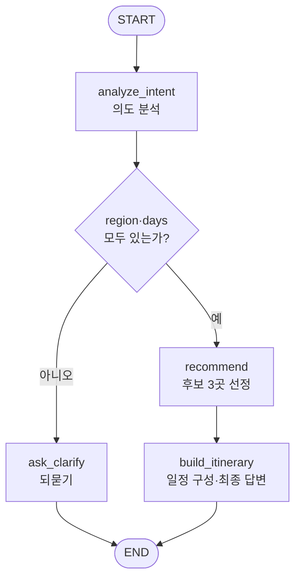

# 0조 — 여행지 추천 플래너

> 한 줄 소개: 가고 싶은 지역과 일정을 말하면 후보지 3곳을 고르고 일자별 일정표까지 만들어 주는 여행 플래너입니다.

**예시 질문**

1. 친구랑 부산 2박 3일 가려고 하는데 맛집 위주로 추천해줘
2. 혼자 조용히 쉴 수 있는 국내 여행지 알려줘
3. 가족이랑 제주도 3일 일정 짜줘

**주제 선정 회의**

> 아래 표는 "이 주제를 어떻게 정했는지"를 확인하기 위한 항목입니다. 조원 전원이 모여서 정한 기록을 남겨주세요.
> (이 문서는 예제라 이름은 가상입니다)

| 항목 | 내용 |
|---|---|
| 회의 일시 | 2026-09-01 (월) 19:00 ~ 20:10 |
| 회의 장소 | 강의장 3층 스터디룸 B (오프라인) |
| 참석자 | 김지훈, 이서연, 박민호, 최유진 — 4명 전원 참석 |
| 불참자 / 사유 | 없음 |
| 기록자 | 김지훈 |

> 📌 **이 문서는 여러분이 쓸 README의 모범답안입니다.**
> 각 조는 `teams/teamN/README.md` 템플릿을 이 문서처럼 채워서 제출하시면 됩니다.
> 채점은 이 문서 하나만 보고 이루어집니다.

---

## 1. LangGraph 워크플로우 설계

### 1.1 State 스키마

| 필드 | 타입 | 설명 |
|---|---|---|
| user_input | str | 이번 턴 사용자 입력 (공용 제공) |
| messages | list[dict] | 이전 대화 이력 (공용 제공) |
| answer | str | 최종 답변 (공용 제공) |
| preferences | dict | 발화에서 추출한 여행 조건 `{region, days, companion, style}` |
| missing | list[str] | 아직 모르는 필수 항목. 비어 있으면 추천 단계로 넘어갑니다 |
| candidates | str | `recommend` 노드가 만든 여행지 후보 3곳 목록 |

`preferences`를 하나의 dict로 묶은 이유는, 조건이 늘어나도 State 필드를 계속 추가하지 않고
프롬프트에 통째로 넘길 수 있기 때문입니다. 반대로 `missing`은 분기 판단에만 쓰이는 값이라
dict 안에 넣지 않고 최상위로 분리했습니다.

### 1.2 노드 구성

| 노드 | 역할 | 읽는 필드 | 쓰는 필드 |
|---|---|---|---|
| `analyze_intent` | 발화에서 지역/일수/동행/취향을 추출하고 정보 충분성 판단 | user_input, messages | preferences, missing |
| `ask_clarify` | 부족한 정보를 되묻는 짧은 질문 생성 | preferences, missing | answer |
| `recommend` | 조건에 맞는 여행지 후보 3곳을 근거와 함께 선정 | preferences | candidates |
| `build_itinerary` | 후보를 일자별 일정표로 구성해 최종 답변 작성 | preferences, candidates | answer |

### 1.3 엣지 & 조건 분기

| 출발 | 조건 | 도착 |
|---|---|---|
| START | - | analyze_intent |
| analyze_intent | `missing`이 비어 있지 않음 (지역 또는 일수를 모름) | ask_clarify |
| analyze_intent | `missing`이 비어 있음 (조건 충족) | recommend |
| ask_clarify | - | END |
| recommend | - | build_itinerary |
| build_itinerary | - | END |

분기 함수는 `route_after_intent(state)` 이고, 반환한 문자열이 다음 노드 이름이 됩니다.

### 1.4 워크플로우 다이어그램



### 1.5 이 구조로 설계한 이유

**하나의 프롬프트로 다 시키지 않은 이유**가 이 설계의 핵심입니다.

처음에는 "사용자 발화를 받아서 여행 일정을 짜줘"라는 프롬프트 하나로 만들었습니다.
그런데 "여행 가고 싶어" 같은 막연한 입력에도 모델이 임의로 지역을 정해버려서
사용자가 원하지 않는 답을 자신 있게 내놓는 문제가 있었습니다.

그래서 **판단**과 **생성**을 분리했습니다.

- `analyze_intent`는 온도 0으로 **추출만** 합니다. 지어내지 않고 모르면 null을 반환하게 했습니다.
- 충분성 판단은 LLM이 아니라 **파이썬 코드**(`missing` 계산)가 합니다. 판단 기준이 코드에 박혀 있어야
  같은 입력에 항상 같은 경로로 흘러갑니다.
- `recommend`(온도 0.7)와 `build_itinerary`(온도 0.6)는 창의성이 필요한 생성 단계라 온도를 높였습니다.

추천과 일정 구성을 또 나눈 이유는, 한 번에 시키면 모델이 후보 선정 근거를 대충 넘기고
일정표 형식을 채우는 데만 집중했기 때문입니다. 후보를 먼저 확정하고 그것을 입력으로
일정을 짜게 하니 "왜 이 장소인지"가 답변에 남았습니다.

---

## 2. 프롬프트 엔지니어링

### 2.1 analyze_intent — 의도 분석

**최종 System Prompt**

```
당신은 여행 상담사의 첫 접수 담당자입니다.
사용자의 발화에서 아래 4가지를 추출하세요.

- region: 가고 싶은 지역 (모르면 null)
- days: 여행 일수 (숫자, 모르면 null)
- companion: 동행 형태 (혼자/친구/연인/가족 중 하나, 모르면 null)
- style: 여행 취향 키워드 배열 (예: ["휴양", "맛집"], 없으면 [])

추측해서 지어내지 마세요. 발화에 없으면 null 입니다.
반드시 아래 JSON 형식으로만 답하세요. 설명 문장을 붙이지 마세요.

{"region": null, "days": null, "companion": null, "style": []}
```

**설계 의도**

이 노드의 출력은 사람이 읽는 글이 아니라 **다음 코드가 파싱할 데이터**입니다.
그래서 (1) 필드를 명시하고 (2) 출력 형식을 예시로 못 박고 (3) 모를 때의 값을 규정했습니다.
"추측해서 지어내지 마세요"가 없으면 모델이 빈칸을 채우려 듭니다.

**개선 전 → 후**

| 구분 | 내용 |
|---|---|
| 개선 전 | `사용자 발화에서 여행 조건을 뽑아주세요.` |
| 그때의 문제 | 응답이 `물론이죠! {"region": "부산"} 입니다` 처럼 나와 `json.loads`가 실패했습니다. 또 "여행 가고 싶어"라는 입력에 `{"region": "제주도"}`를 임의로 채워 넣어, 되묻기 분기로 가야 할 대화가 바로 추천으로 넘어갔습니다. |
| 개선 후 | 필드 4개와 각각의 null 규칙을 명시하고, "반드시 아래 JSON 형식으로만 답하세요. 설명 문장을 붙이지 마세요." + 예시 JSON을 붙였습니다. 온도도 0.0으로 낮췄습니다. |
| 달라진 점 | 파싱 실패가 사라졌고, 모르는 값을 지어내지 않아 되묻기 분기가 의도대로 동작하게 되었습니다. |

> 다만 프롬프트만 믿지 않고 코드에도 안전장치를 뒀습니다.
> `raw[raw.index("{"):raw.rindex("}")+1]`로 앞뒤 설명을 잘라내고, 그래도 실패하면 전부 null로 처리해
> 되묻기 분기로 흘려보냅니다. **LLM 출력은 언제든 형식이 깨질 수 있다고 가정하고 짜야 합니다.**

### 2.2 ask_clarify — 되묻기

**최종 System Prompt**

```
당신은 친절한 여행 상담사입니다.
아직 모르는 정보를 사용자에게 되묻는 짧은 질문을 작성하세요.

- 한 번에 최대 2가지만 묻습니다.
- 3문장 이내로 답합니다.
- 예시를 하나 곁들여 사용자가 답하기 쉽게 만드세요.
```

**설계 의도**

되묻기는 짧아야 합니다. 길면 사용자가 답을 포기합니다.
"최대 2가지", "3문장 이내"처럼 **숫자로 제한**을 걸어야 모델이 지킵니다.
"예시를 곁들여라"는 사용자의 답변 형식을 유도해 다음 턴의 추출 정확도를 올리기 위한 장치입니다.

**개선 전 → 후**

| 구분 | 내용 |
|---|---|
| 개선 전 | `부족한 정보를 물어보세요.` |
| 그때의 문제 | 지역·일수·동행·예산·숙소 취향까지 한 번에 5개를 묻는 긴 문단이 나왔습니다. |
| 개선 후 | "한 번에 최대 2가지", "3문장 이내" 제한을 숫자로 추가했습니다. |
| 달라진 점 | "어느 지역으로 가고 싶으세요? 며칠 일정인지도 알려주시면 좋아요. (예: 부산 2박 3일)" 수준으로 짧아졌습니다. |

### 2.3 recommend — 후보 선정

**최종 System Prompt**

```
당신은 여행지 추천 전문가입니다.
주어진 조건에 맞는 여행지 후보 3곳을 고르세요.

각 후보마다 이렇게 씁니다.
- 장소 이름
- 추천 이유 1문장 (주어진 조건과 어떻게 연결되는지 반드시 언급)
- 추천 시간대 (오전/오후/저녁)

목록만 출력하고 인사말은 붙이지 마세요.
```

**설계 의도**

"조건과 어떻게 연결되는지 반드시 언급"이 이 프롬프트의 핵심입니다.
이 문구가 없으면 어떤 조건을 줘도 유명 관광지만 나열합니다.
"추천 시간대"를 여기서 미리 받아두면 다음 노드가 일정을 짤 때 근거로 씁니다.
이 노드의 출력은 중간 산출물이라 인사말을 금지했습니다.

**개선 전 → 후**

| 구분 | 내용 |
|---|---|
| 개선 전 | `조건에 맞는 여행지를 추천해주세요.` |
| 그때의 문제 | "맛집 위주"라고 해도 해운대·광안리 같은 일반 명소만 나오고, 취향이 반영되지 않았습니다. |
| 개선 후 | 후보 수를 3곳으로 고정하고, 이유에 "주어진 조건과 어떻게 연결되는지 반드시 언급"을 넣었습니다. |
| 달라진 점 | "부산 3대 돼지국밥 골목 — 맛집 위주 요청에 맞춰 아침 식사 코스로" 처럼 조건이 드러나는 추천이 나옵니다. |

### 2.4 build_itinerary — 일정 구성

**최종 System Prompt**

```
당신은 여행 일정 설계자입니다.
후보 목록을 받아 일자별 일정표로 정리하고 사용자에게 보낼 최종 답변을 작성하세요.

형식:
1. 첫 줄에 한 줄 요약
2. "Day 1", "Day 2" ... 로 나눈 일정 (각 날짜마다 오전/오후/저녁)
3. 마지막에 준비물이나 팁 2가지

마크다운을 사용하고, 친근한 존댓말로 작성하세요.
```

**설계 의도**

이 노드의 출력만 사용자 화면에 보입니다. 그래서 **출력 형식을 번호로 명시**했습니다.
UI가 마크다운을 렌더링하므로 마크다운 사용을 지시했고, 톤도 여기서 한 번만 정합니다.

**개선 전 → 후**

| 구분 | 내용 |
|---|---|
| 개선 전 | `후보를 일정으로 만들어주세요.` |
| 그때의 문제 | 일수를 2일로 줬는데 Day 3까지 만들거나, 시간대 구분 없이 한 문단으로 나열했습니다. |
| 개선 후 | 형식을 1·2·3 번호로 못 박고, 각 날짜마다 오전/오후/저녁을 요구했습니다. |
| 달라진 점 | 요청한 일수를 지키고, 매일 3개 시간대가 채워진 표 형태의 답변이 안정적으로 나옵니다. |

---

## 3. 실행 결과 & 회고

### 3.1 실행 예시

> 맨 위에 적은 **예시 질문 3개가 각각 정상 동작하는 화면을 캡처해서** 아래에 붙여주세요.
> 캡처 파일은 `teams/team0/screenshots/` 폴더에 넣고, 답변과 함께 **하단의 실행 노드 배지가 보이게** 찍어주세요.
> (이 문서는 예제라 실제 캡처 파일은 넣지 않았습니다. 아래 형식만 참고하세요.)

**케이스 1 — 조건이 다 있는 질문**

| 입력 | 출력 (요약) | 실행 노드 |
|---|---|---|
| 친구랑 부산 2박 3일 가려고 하는데 맛집 위주로 추천해줘 | `{region: "부산", days: 2, companion: "친구", style: ["맛집"]}` 추출 → 후보 3곳(돼지국밥 골목, 광안리 해변, 전포 카페거리) → Day 1/Day 2 일정표 + 준비물 2가지 | `analyze_intent → recommend → build_itinerary` |

```markdown

```

**케이스 2 — 동행·취향 위주 질문**

| 입력 | 출력 (요약) | 실행 노드 |
|---|---|---|
| 혼자 조용히 쉴 수 있는 국내 여행지 알려줘 | `{companion: "혼자", style: ["휴양"]}` 추출 → 되묻기로 지역·일수를 받은 뒤 한적한 후보 3곳 → 일정표 | `analyze_intent → ask_clarify` (다음 턴) `analyze_intent → recommend → build_itinerary` |

```markdown

```

**케이스 3 — 가족 일정 질문**

| 입력 | 출력 (요약) | 실행 노드 |
|---|---|---|
| 가족이랑 제주도 3일 일정 짜줘 | `{region: "제주도", days: 3, companion: "가족"}` 추출 → 이동 부담이 적은 후보 3곳 → Day 1~3 일정표 | `analyze_intent → recommend → build_itinerary` |

```markdown

```

### 3.2 잘 된 점 / 한계 / 개선 아이디어

- **잘 된 점**: 판단(코드)과 생성(LLM)을 분리해서 같은 입력이 항상 같은 경로로 흐릅니다.
  LLM 출력이 깨져도 되묻기로 안전하게 흘러가 사용자가 에러 화면을 보지 않습니다.
- **한계**:
  - 실제 여행 정보를 검색하지 않고 모델의 사전 지식에만 의존합니다. 영업시간·휴무일이 부정확할 수 있습니다.
  - 되묻기 이후 사용자가 답하면 `messages`로 이전 맥락이 전달되긴 하지만,
    이미 추출한 `preferences`는 턴마다 새로 뽑습니다. 누적 병합을 하지 않는 것이 가장 큰 구조적 한계입니다.
  - 예산·이동수단은 추출하지 않습니다.
- **다음에 개선한다면**:
  1. `preferences`를 턴 간에 누적 병합해 되묻기 왕복을 줄이기
  2. 맛집·숙소·교통을 각각 조회하는 서브에이전트를 병렬로 붙이고 결과를 통합하는 노드 추가
  3. `build_itinerary` 뒤에 일정의 이동 동선이 말이 되는지 검수하는 `review` 노드 추가

### 3.3 배운 점

- **노드를 나누는 기준은 "책임"이지 "단계"가 아닙니다.** 추출·판단·생성은 요구하는 온도와
  실패 처리 방식이 다르기 때문에 나눌 가치가 있었습니다. 반대로 단순히 순서만 다른 작업을
  억지로 나누면 LLM 호출 횟수만 늘어납니다.
- **분기 조건은 LLM이 아니라 코드가 판단하게 하는 편이 안정적입니다.** "정보가 충분한가?"를
  모델에게 물으면 같은 입력에도 답이 흔들립니다.
- **프롬프트로 형식을 강제해도 코드에 방어 로직은 필요합니다.** 출력 형식은 반드시 언젠가 깨집니다.
- 온도는 노드마다 다르게 줘야 합니다. 추출은 0.0, 생성은 0.6~0.7이 잘 맞았습니다.
