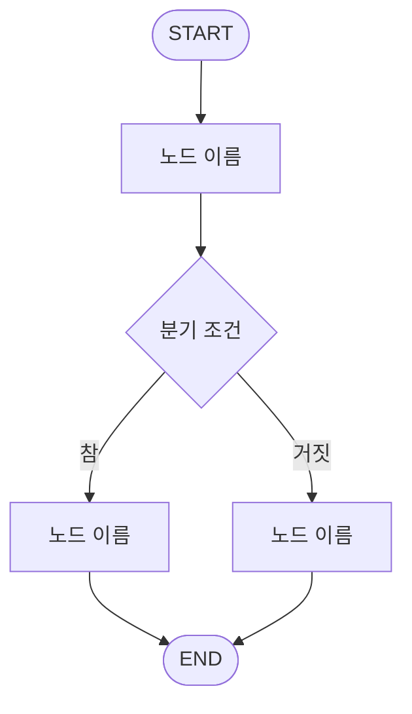

# 3조 — (프로젝트 이름을 적어주세요)

> 한 줄 소개: (이 에이전트가 무엇을 해주는지 한 문장으로)

**예시 질문**

1. (사용자가 이렇게 물어보면 됩니다)
2.
3.

**주제 선정 회의**

> 조원이 실제로 모여서 주제를 정했는지 확인하는 항목입니다. 빈칸 없이 채워주세요.

| 항목 | 내용 |
|---|---|
| 회의 일시 | (예: 2026-09-01 (월) 19:00 ~ 20:10) |
| 회의 장소 | (오프라인으로 모인 장소, 예: 강의장 3층 스터디룸 B) |
| 참석자 | (참석한 조원 이름 전부, 예: 홍길동, 김철수, 이영희 — 3명 중 3명) |
| 불참자 / 사유 | (없으면 "없음") |
| 기록자 | |

---

## 1. LangGraph 워크플로우 설계

### 1.1 State 스키마

| 필드 | 타입 | 설명 |
|---|---|---|
| user_input | str | 이번 턴 사용자 입력 (공용 제공) |
| messages | list[dict] | 이전 대화 이력 (공용 제공) |
| answer | str | 최종 답변 (공용 제공) |
|  |  |  |

### 1.2 노드 구성

| 노드 | 역할 | 읽는 필드 | 쓰는 필드 |
|---|---|---|---|
|  |  |  |  |

### 1.3 엣지 & 조건 분기

| 출발 | 조건 | 도착 |
|---|---|---|
| START | - |  |
|  |  |  |

### 1.4 워크플로우 다이어그램

> 아래 mermaid 를 우리 조 그래프에 맞게 고쳐주세요. 실제 코드와 반드시 일치해야 합니다.



### 1.5 이 구조로 설계한 이유

(왜 노드를 이렇게 나눴는지, 왜 이 지점에 분기를 뒀는지 적어주세요.
"프롬프트 하나로 다 시키지 않고 굳이 나눈 이유"가 핵심입니다.)

---

## 2. 프롬프트 엔지니어링

노드마다 아래 3가지를 적어주세요. 노드가 여러 개면 2.1, 2.2 … 로 늘려가면 됩니다.

### 2.1 (노드 이름)

**최종 System Prompt**

```
(prompts.py 의 최종 문구를 그대로 붙여넣어 주세요)
```

**설계 의도**

(이 프롬프트가 무엇을 보장하려고 하는지)

**개선 전 → 후 (최소 1회 필수)**

| 구분 | 내용 |
|---|---|
| 개선 전 | (처음 썼던 프롬프트) |
| 그때의 문제 | (어떤 이상한 출력이 나왔는지 실제 예시) |
| 개선 후 | (어떻게 고쳤는지) |
| 달라진 점 | (출력이 어떻게 좋아졌는지) |

---

## 3. 실행 결과 & 회고

### 3.1 실행 예시

> 맨 위에 적은 **예시 질문 3개가 각각 정상 동작하는 화면을 캡처해서** 아래에 붙여주세요.
> 캡처 파일은 `teams/team3/screenshots/` 폴더에 넣고, 답변과 함께 **하단의 실행 노드 배지가 보이게** 찍어주세요.
> 캡처 없이 글로만 적은 것은 실행 확인으로 인정되지 않습니다.

**케이스 1**

| 입력 | 출력 (요약) | 실행 노드 |
|---|---|---|
|  |  |  |


**케이스 2**

| 입력 | 출력 (요약) | 실행 노드 |
|---|---|---|
|  |  |  |


**케이스 3**

| 입력 | 출력 (요약) | 실행 노드 |
|---|---|---|
|  |  |  |


### 3.2 잘 된 점 / 한계 / 개선 아이디어

- **잘 된 점**:
- **한계**:
- **다음에 개선한다면**:

### 3.3 배운 점

(LangGraph, 멀티에이전트 설계, 프롬프트에 대해 새로 알게 된 것)

---

## 산출물 정리 회의

> 문서를 어떻게 마무리했는지 남기는 항목입니다. 빈칸 없이 채워주세요.

| 항목 | 내용 |
|---|---|
| 회의 일시 | (예: 2026-09-12 (금) 19:00 ~ 20:30) |
| 회의 장소 | (오프라인으로 모인 장소) |
| 참석자 | (참석한 조원 이름 전부 — N명 중 N명) |
| 불참자 / 사유 | (없으면 "없음") |
| 기록자 | |

**어떻게 진행했는지**

(무엇을 어떤 순서로 했는지 3~5줄. 예: 각자 맡은 노드를 설명 → 예시 질문 3개를 함께 돌려보며 캡처 →
다이어그램과 코드 대조 → 한계·배운 점 정리 → 함께 커밋)

-
-
-
