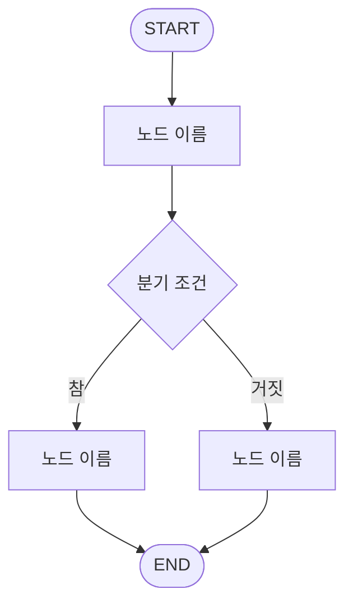

# 7조 — (프로젝트 이름을 적어주세요)

> 한 줄 소개: (이 에이전트가 무엇을 해주는지 한 문장으로)

**예시 질문**

1. (사용자가 이렇게 물어보면 됩니다)
2.
3.

---

## 1. LangGraph 워크플로우 설계

### 1.1 State 스키마

| 필드 | 타입 | 설명 |
|---|---|---|
| user_input | str | 이번 턴 사용자 입력 (공용 제공) |
| messages | list[dict] | 이전 대화 이력 (공용 제공) |
| answer | str | 최종 답변 (공용 제공) |
|  |  |  |

### 1.2 노드 구성

| 노드 | 역할 | 읽는 필드 | 쓰는 필드 |
|---|---|---|---|
|  |  |  |  |

### 1.3 엣지 & 조건 분기

| 출발 | 조건 | 도착 |
|---|---|---|
| START | - |  |
|  |  |  |

### 1.4 워크플로우 다이어그램

> 아래 mermaid 를 우리 조 그래프에 맞게 고쳐주세요. 실제 코드와 반드시 일치해야 합니다.



### 1.5 이 구조로 설계한 이유

(왜 노드를 이렇게 나눴는지, 왜 이 지점에 분기를 뒀는지 적어주세요.
"프롬프트 하나로 다 시키지 않고 굳이 나눈 이유"가 핵심입니다.)

---

## 2. 프롬프트 엔지니어링

노드마다 아래 3가지를 적어주세요. 노드가 여러 개면 2.1, 2.2 … 로 늘려가면 됩니다.

### 2.1 (노드 이름)

**최종 System Prompt**

```
(prompts.py 의 최종 문구를 그대로 붙여넣어 주세요)
```

**설계 의도**

(이 프롬프트가 무엇을 보장하려고 하는지)

**개선 전 → 후 (최소 1회 필수)**

| 구분 | 내용 |
|---|---|
| 개선 전 | (처음 썼던 프롬프트) |
| 그때의 문제 | (어떤 이상한 출력이 나왔는지 실제 예시) |
| 개선 후 | (어떻게 고쳤는지) |
| 달라진 점 | (출력이 어떻게 좋아졌는지) |

---

## 3. 실행 결과 & 회고

### 3.1 실행 예시

**예시 1 — 정상 케이스**

| 입력 | 출력 |
|---|---|
|  |  |

**예시 2 — 실패 / 엣지 케이스 (필수)**

| 입력 | 출력 | 왜 이렇게 나왔는지 |
|---|---|---|
|  |  |  |

(스크린샷이 있으면 함께 첨부해주세요)

### 3.2 잘 된 점 / 한계 / 개선 아이디어

- **잘 된 점**:
- **한계**:
- **다음에 개선한다면**:

### 3.3 역할 분담

| 이름 | 맡은 부분 |
|---|---|
|  |  |

### 3.4 배운 점

(LangGraph, 멀티에이전트 설계, 프롬프트에 대해 새로 알게 된 것)

---

## 제출 체크리스트

- [ ] `python scripts/selfcheck.py team7` 통과
- [ ] `TEAM_INFO` 의 name / description / examples(3개) 작성
- [ ] 화면에서 실제로 대화가 되는 것 확인
- [ ] 1.1 ~ 1.3 표 작성
- [ ] 1.4 mermaid 다이어그램이 실제 코드와 일치
- [ ] 2장에 노드별 프롬프트 전문 + 개선 전/후 1회 이상
- [ ] 3.1 실행 예시 2건 (실패 케이스 포함)
- [ ] `git diff --name-only` 로 `teams/team7/` 밖 파일을 건드리지 않았는지 확인
